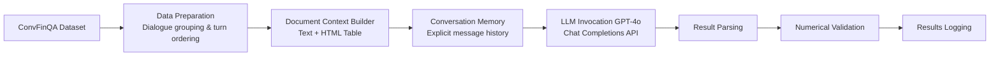

# 🏦 LLMConvFinQA: Conversational Financial Question Answering

> ** LLM-powered system for multi-turn financial document analysis**

---

## 🎯 **What This Does**

Transform complex financial documents into **intelligent conversations**. The system processes financial tables and contextual text to answer sophisticated financial questions through **multi-turn dialogues**.

### ✨ **Key Capabilities**
- 📊 **Financial Document Processing** - Handles financial tables + surrounding text
- 🧠 **Conversational Memory** - Maintains context across question sequences  
- 🔢 **Numerical Reasoning** - Performs calculations, comparisons, and percentage changes
- 🎯 **High Accuracy** - Tolerance-based answer validation with precision matching
- 📝 **Detailed Logging** - Complete conversation traces saved to file

---

## 📊 **Input Data Structure**

### 🗂️ **ConvFinQA Dataset Overview**
The system processes the ConvFinQA (Conversational Financial Question Answering) dataset, which contains multi-turn conversations about financial documents.

### 📋 **Data Organization**
- **Total Entries**: ~1,490 individual question-answer pairs
- **Unique Dialogues**: ~421 conversational sequences  
- **Average Length**: 3.5 turns per dialogue
- **Format**: JSON array with structured annotations

### 🏗️ **Entry Structure**
Each data entry represents one turn in a financial conversation:

```json
{
  "id": "Single_MRO/2007/page_134.pdf-1_0",
  "filename": "MRO/2007/page_134.pdf",
  "annotation": {
    "amt_table": "<table class='wikitable'>...</table>",
    "amt_pre_text": "Context before the table...",
    "amt_post_text": "Context after the table...",
    "cur_dial": [
      "what was the weighted average exercise price per share in 2007?"
    ],
    "dialogue_break": [
      "what was the weighted average exercise price per share in 2007?",
      "and what was it in 2005?",
      "what was, then, the change over the years?"
    ],
    "exe_ans": 60.94,
    "turn_ind": 0
  }
}
```

### 🔍 **Key Fields Explained**

| Field | Purpose | Example |
|-------|---------|---------|
| **`id`** | Unique identifier with dialogue + turn | `"Single_MRO/2007/page_134.pdf-1_0"` |
| **`amt_table`** | Financial table in HTML format | `<table>...</table>` |
| **`amt_pre_text`** | Context text before table | Company background info |
| **`amt_post_text`** | Context text after table | Additional explanations |
| **`cur_dial`** | Cumulative conversation history | `["Q1", "Q1 Q2"]` |
| **`dialogue_break`** | Individual questions per turn | `["Q1", "Q2", "Q3"]` |
| **`exe_ans`** | Expected numerical answer | `60.94` |
| **`turn_ind`** | Turn index within dialogue | `0, 1, 2, 3...` |

### 🔄 **Conversation Flow Example**
```
Dialogue: Single_MRO/2007/page_134.pdf-1
├── Turn 0: "What was the price in 2007?" → Answer: 60.94
├── Turn 1: "And in 2005?" → Answer: 25.14  
├── Turn 2: "What was the change?" → Answer: 35.8
├── Turn 3: "What was the 2005 price?" → Answer: 25.14
└── Turn 4: "What's the percentage change?" → Answer: 1.42403
```

### 📈 **Financial Table Format**
Tables contain structured financial data with:
- **Row Headers**: Metric names (e.g., "weighted average exercise price per share")
- **Column Headers**: Time periods (e.g., "2007", "2006", "2005")  
- **Data Cells**: Numerical values with currency symbols and formatting
- **Row Numbers**: First column contains sequential numbering (ignored in processing)

---

## 🚀 **Live Example**

```
💬 CONVERSATION FLOW:
┌─────────────────────────────────────────────────────────────┐
│ Turn 1: "What was the weighted average exercise price       │
│         per share in 2007?"                                │
│ 🤖 Answer: 60.94                                           │
├─────────────────────────────────────────────────────────────┤
│ Turn 2: "And what was it in 2005?"                        │
│ 🤖 Answer: 25.14 (remembers 2007 context)                 │
├─────────────────────────────────────────────────────────────┤
│ Turn 3: "What was the change over the years?"             │
│ 🤖 Answer: 35.8 (60.94 - 25.14 = 35.8)                   │
├─────────────────────────────────────────────────────────────┤
│ Turn 4: "What was the percentage change?"                 │
│ 🤖 Answer: 1.42403 (142.4% increase)                      │
└─────────────────────────────────────────────────────────────┘
```

---

## 🏗️ **System Architecture**



### 🧩 **Core Components**

| Component | Function | Technology |
|-----------|----------|------------|
| **🧠 ConversationMemory** | Maintains dialogue context | Custom Python Class |
| **🔍 Document Parser** | Extracts tables + text | Financial Table Processing |
| **🤖 LLM Engine** | Financial reasoning | OpenAI GPT-4o |
| **✅ Validator** | Answer verification | Tolerance-based matching |
| **📊 Logger** | Results tracking | File + Console output |

---

## 📊 **Performance Metrics**

### 🎯 **Accuracy Tracking**
- **Absolute Tolerance**: `1e-4` for precise numerical matching
- **Relative Tolerance**: `1e-3` for percentage-based comparisons
- **Real-time Validation**: Immediate feedback on answer correctness

### 📈 **Sample Results**
```
🏆 DIALOGUE PERFORMANCE:
├── Dialogue 1: ✅ 5/5 questions (100% accuracy)
├── Dialogue 2: ✅ 4/5 questions (80% accuracy)  
└── Overall: ✅ 9/10 questions (90% accuracy)
```

---

## 🛠️ **Quick Start**

### 1️⃣ **Setup Environment**
```bash
# Clone and navigate
git clone <repository>
cd fin-doc-qa

# Install dependencies
pip install -r requirements.txt

# Configure API key
echo "OPENAI_API_KEY=your_key_here" > .env
```

### 2️⃣ **Run the System**
```bash
python src/main.py
```

### 3️⃣ **View Results**
- **Console**: Real-time progress and results
- **File**: Complete log saved to `results.txt`

---

## 📁 **Project Structure**

```
fin-doc-qa/
├── 📄 README.md              # Project documentation
├── 📋 CHANGELOG.md           # Version history
├── 🔧 setup.py               # Package configuration
├── 🔧 requirements.txt       # Python dependencies
├── 🔐 .env.example           # Environment template
├── � .gitigenore            # Git ignore rules
├── 📊 results.txt            # Sample output results
├── � src/
│   ├── � lmain.py            # Main implementation
│   └── � system_prompt.txt  # External prompt configuration
├── 📂 scripts/
│   └── � setup.swh           # Setup script
└── � data/y
    └── 📋 dev_turn.json      # ConvFinQA dataset
```

---

## 🎛️ **Configuration Options**

### ⚙️ **System Settings**
```python
MODEL_NAME = "gpt-4o"                # LLM model
MAX_DIALOGUES = None                 # Process all dialogues  
SLEEP_BETWEEN_CALLS = 1.0            # API rate limiting
RESULTS_FILE = "results.txt"         # Output file
```

### 🎯 **Accuracy Tuning**
```python
relative_tolerance = 1e-3            # 0.1% tolerance
absolute_tolerance = 1e-4            # 0.0001 absolute
```

---

## 🔬 **Technical Deep Dive**

### 🧠 **Memory Management**
- **Stateful Conversations**: Each dialogue maintains complete history
- **Context Preservation**: Previous Q&A pairs inform subsequent answers
- **Memory Cleanup**: Fresh start for each new dialogue

### 🎯 **Financial Reasoning Rules**
- **Calculation Logic**: Change = later_year - earlier_year
- **Percentage Logic**: (new - old) / old × 100
- **Data Sources**: Financial tables + contextual text
- **Answer Format**: Strict JSON with calculations and sources

### 📊 **Output Schema**
```json
{
  "used_cells": ["actual table values"],
  "calculation": "step-by-step math",
  "answer": "numeric result"
}
```

---

## 🎨 **Sample Output**

```
================================================================================
Processing Dialogue: Single_MRO/2007/page_134.pdf-1
Number of turns: 5
================================================================================

  Turn 1: Q: What was the weighted average exercise price per share in 2007?
  Turn 1: Pred: 60.94
  Turn 1: Gold: 60.94
  Turn 1: Match: ✅ True
  Turn 1: Details: {'used_cells': ['$ 60.94'], 'calculation': 'direct lookup', 'answer': '60.94'}
  Turn 1: Memory has 2 messages

  Turn 2: Q: And what was it in 2005?
  Turn 2: Pred: 25.14
  Turn 2: Gold: 25.14  
  Turn 2: Match: ✅ True
  Turn 2: Details: {'used_cells': ['$ 25.14'], 'calculation': 'direct lookup', 'answer': '25.14'}
  Turn 2: Memory has 4 messages

🏆 Dialogue Results: ✅ 5/5 (100% accuracy)
```